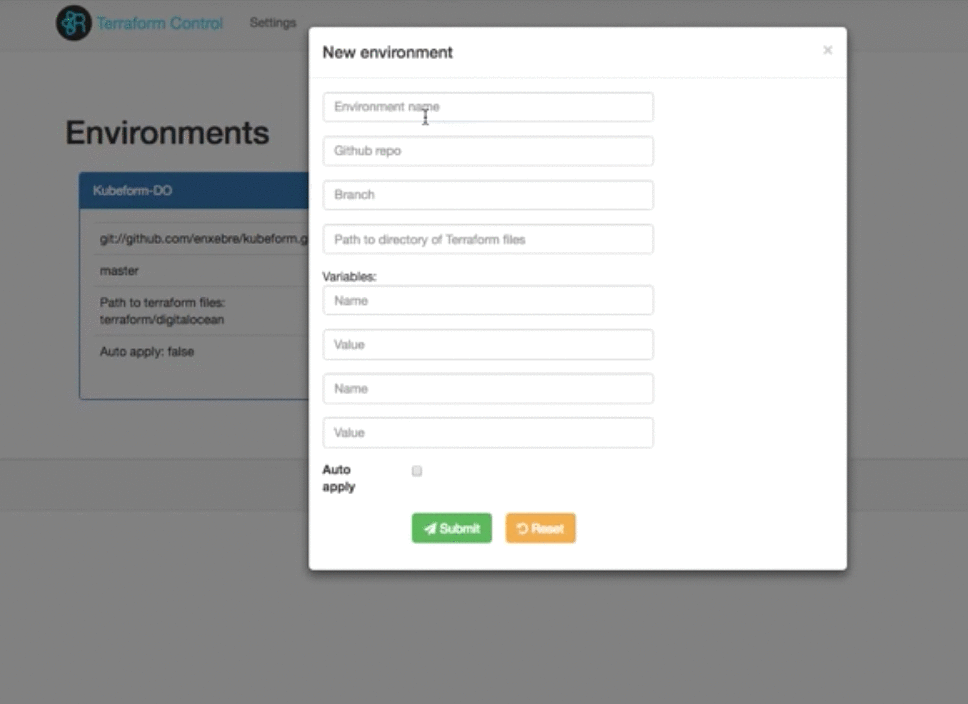

# Terraform-Control

Terraform-Control is a tool for managing and deploying your infrastructure with terraform in a collaborative way driven by Continuous integration while keeping track of the state and history of your infrastructure.

## Overview

We have reused loads of the [Otto](https://github.com/hashicorp/otto/) code for running terraform commands over different environments simlulating an [Atlas terraform](https://atlas.hashicorp.com/terraform) style feature to demonstrate how to use terraform in a collaborative way driven by continuous integration while keeping track of the state of your environment in a centralise way.
**This is just a PoC and it's obviously missing a lot features to be used in a real environment at the minute.**

## Demo

## Web UI

